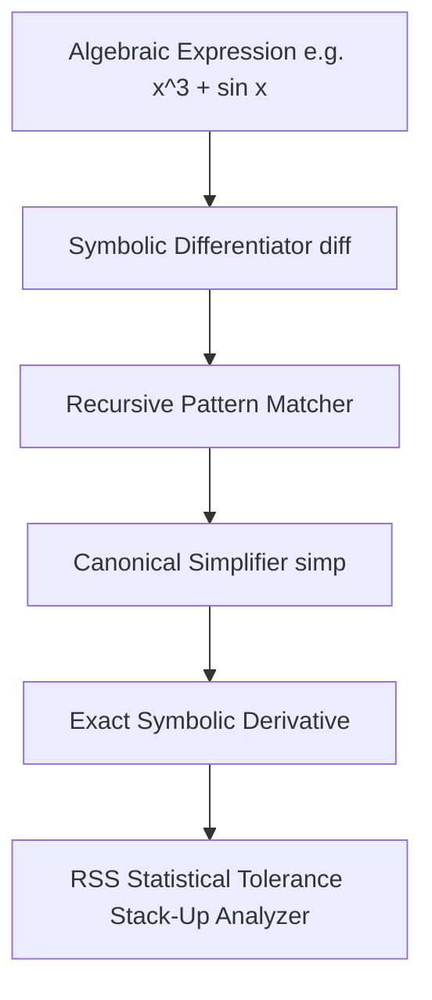

# 13 - Symbolic Calculus & Tolerance Reasoning Engine (Common Lisp)

## Executive Overview
A computer algebra and engineering tolerance reasoning system written in **ANSI Common Lisp**. It performs exact symbolic differentiation, algebraic canonical reduction, and statistical **Root-Sum-Square (RSS)** tolerance stack-up analysis for precision aerospace assemblies (e.g., high-pressure turbine blade clearances).

## Symbolic Reasoning Pipeline



### Source Tree
- **`src/symbolic_reasoner.lisp`**: Pure Common Lisp engine implementing expression trees, symbolic differentiation rules, algebraic simplifiers, and RSS variance estimators.
- **`src/run_sbcl.sh`**: Runner script for Steel Bank Common Lisp (SBCL).
- **`runner/run.js`**: Self-contained Lisp VM simulation verifying differentiation outputs.

## Mathematical Formulation: Root-Sum-Square (RSS) Tolerancing
For an assembly dimension $Y = f(X_1, X_2, \dots, X_n)$, the combined tolerance variance is:
$$\sigma_Y = \sqrt{\sum_{i=1}^{n} \left( \frac{\partial f}{\partial X_i} \right)^2 \sigma_{X_i}^2}$$

## Native SBCL Execution
```bash
sbcl --load src/symbolic_reasoner.lisp --quit
```

## Universal Verification
```bash
node runner/run.js
node orchestrator/run.js --project=13-lisp
```

## Senior Interview Q&A
- **Q: Why is Lisp well-suited for symbolic mathematics?** Homoiconicity: code is data. S-expressions represent mathematical expression trees natively, eliminating AST parsing overhead and enabling elegant pattern-matching transformation rules.
- **Q: How does RSS tolerancing compare to worst-case tolerancing?** Worst-case tolerancing linearly sums tolerances ($T = \sum T_i$), which over-constrains manufacturing and inflates machining costs. RSS tolerancing models independent Gaussian variations, reducing scrap rates while preserving six-sigma yield.\n